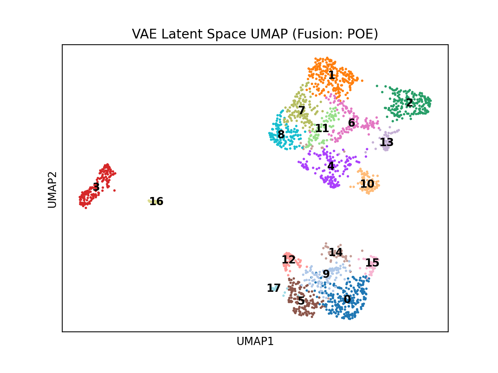
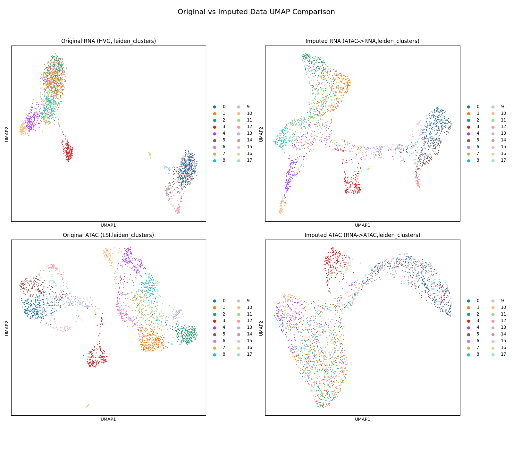

# Multimodal VAE for Single-Cell RNA-seq and ATAC-seq Integration

## Project Overview

This project implements and evaluates a Multimodal Variational Autoencoder (VAE) designed to integrate single-cell gene expression (RNA-seq) and chromatin accessibility (ATAC-seq) data. The goal is to learn a joint latent representation that captures the shared biological variation across both modalities, enabling tasks like cross-modal imputation and potentially improved cell type identification or trajectory analysis.

The model utilizes separate encoders for RNA and ATAC data, a fusion network (either MLP-based or Product of Experts) to combine modality-specific information, and separate decoders to reconstruct the original data from the shared latent space.

**Key Features:**

*   Handles raw 10x Multiome data input (`filtered_feature_bc_matrix.h5`).
*   Implements standard preprocessing pipelines for scRNA-seq (Normalization, Log-transform, HVG selection) and scATAC-seq (LSI using SVD directly on filtered count-like data).
*   Supports two fusion mechanisms:
    *   MLP Fusion: Concatenates latent means and processes through an MLP.
    *   Product of Experts (PoE): Mathematically combines modality distributions with a prior.
*   Utilizes KL Annealing during training to mitigate posterior collapse.
*   Provides quantitative evaluation of cross-modal imputation using Cosine Similarity and Pearson Correlation.
*   Includes visualization of the learned latent space (UMAP, Leiden clustering) and imputation quality assessment.

## Usage

The main script can be run with various command-line arguments to configure the training process:

```bash
python main.py --data_path data/pbmc_granulocyte_sorted_10k_filtered_feature_bc_matrix.h5 \
               --model_name vae_model.pt \
               --checkpoint_dir checkpoints/ \
               --vis_output_dir results/plots \
               --fusion mlp \
               --epochs 1000 \
               --lr 1e-4 \
               --kl_beta_max 1.5 \
               --kl_warmup_epochs 100
```


## Visualization

The repository includes a separate visualization script for analyzing the model's latent space:

```bash
python run_visualization.py --model_path checkpoints/vae_model.pt \
                           --data_path data/pbmc_granulocyte_sorted_10k_filtered_feature_bc_matrix.h5 \
                           --output_dir results/plots
```
## Data


Data used can be downloaded from the following link:
https://www.10xgenomics.com/datasets/pbmc-from-a-healthy-donor-granulocytes-removed-through-cell-sorting-10-k-1-standard-1-0-0

## Results

These are the results for both imputation directions using poe (Product of experts) fusion method for this architecture.


--- Evaluation Results (Fusion: POE) ---
Metric       | RNA -> ATAC | ATAC -> RNA
-------------|-------------|------------
Cosine Sim   |      0.7078 |      0.7250
Pearson Corr |      0.6936 |      0.7039
----------------------------------------

**Cosine Similarity** measures the angle between the imputed and ground truth vectors in feature space, indicating how well the model preserves the relative directionality of features. Values above 0.70 for both directions suggest the model successfully captures the structure of each modality.
**Pearson Correlation** quantifies the linear relationship between original and imputed features. The values near 0.70 further validate that the model preserves biologically relevant variation in the latent space and reconstructs meaningful cross-modal signals.
Overall, these results indicate that the model learned a shared representation capable of generalizing well across modalities.

## Plots


**Latent Space UMAP (Test Set)**  

This UMAP visualizes the shared latent space (mu_z) learned by the VAE (using PoE fusion ) for the test set cells. Each point represents a single cell. Cells are colored based on the unsupervised Leiden cluster they were assigned to based on their proximity in the high-dimensional latent space. Clear separation between different colored clusters indicates the model successfully grouped cells with similar integrated RNA/ATAC profiles. The spatial arrangement can hint at relationships between cell states or lineages. The quality of separation here suggests the model learned a biologically meaningful representation.


**Cross-Modal Imputation Comparison**  

This plot provides a qualitative assessment of cross-modal imputation quality. All subplots are colored by the same Leiden cluster assignments derived from the latent space UMAP.


**Marker Gene Dot Plot**  

This plot highlights potential marker genes that differentiate the Leiden clusters found in the latent space. Columns correspond to Leiden clusters (0–17), while rows show the top differentially expressed genes per cluster. Dot color represents the average expression level among expressing cells, and dot size reflects the fraction of cells in the cluster expressing that gene.
